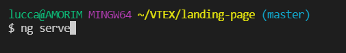

# LandingPage :framed_picture:

#### INÍCIO

Fala galera, esta é minha Landing Page que tem o intuito de oferecer promoções de pisos hidráulicos somente para os usuários que se cadastrarem na página.

Procurei aplicar os conceitos que aprendi quando estava desenvolvendo o Projeto-Dio-Live4 (Link do repositório: https://github.com/Amorim-cyber/Projeto-Dio-Live4) 

Segue o link para acessar a página:

```shell script
https://amorim-cyber.github.io/TileLandingPage/PROMO%C3%87%C3%83O
```

#### TECHS UTILIZADAS

* Node.js
* Angular CLI
* Alguma IDE de sua escolha

#### INSTRUÇÕES

Caso você queira rodar a site em sua máquina local siga os seguintes passos:

1. Baixe os arquivos deste repositório

2. Execute o comando `ng serve` em seu terminal dentro do diretório deste projeto

   </img>

3. Digite `http://localhost:4200/PROMOÇÃO`  no seu navegador.

</img>

#### PRONTO

 A página está pronta para uso.

</img>

#### Observações importantes:

1. Está página foi criada para fins ilustrativos, não há funcionalidade para o botão ENVIAR.
2. A página retorna um erro 404 caso o link sofra alterações


#### Forte abraço a todos! :smile:

